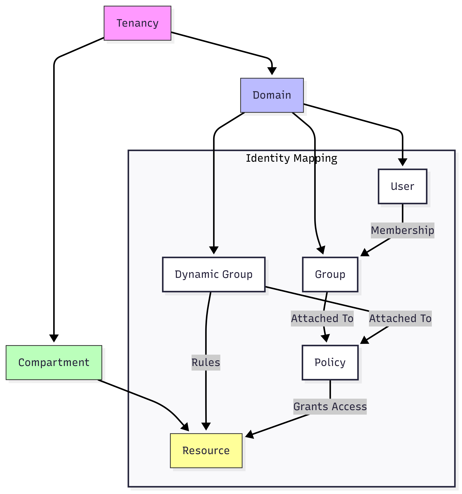

# OCI Identity & Access Management (IAM) Mapping

## 📌 Overview
This document maps and explains the core OCI IAM components: **Domain**, **User**, **Dynamic Group**, **Policies**, **Compartments**, and how they link to **Resources**. Includes examples and policy types.

---

## 🔗 Component Mapping



---

## 📘 Component Descriptions

| **Component**    | **Description**                                                                 |
|------------------|----------------------------------------------------------------------------------|
| **Tenancy**      | Root container for all OCI resources.                                            |
| **Domain**       | IAM container defining isolated users, groups, and policies.                    |
| **User**         | Individual identity that can authenticate and interact with resources.           |
| **Group**        | Logical collection of users; policies are written against groups.                |
| **Dynamic Group**| Rule-based identity group for OCI resources like compute instances.              |
| **Policy**       | Set of rules that grant access to groups or dynamic groups for specific actions. |
| **Compartment**  | Logical resource container for access control and organization.                  |
| **Resource**     | Any OCI entity (e.g., Compute instance, DB system, Bucket, etc.).                |

---

## 🛡️ OCI IAM Policy Basics

OCI Policies are written in **human-readable policy statements**, and assigned at the **tenancy** or **compartment** level.

### 🔹 Policy Syntax

```hcl
Allow <subject> to <verb> <resource-type> in <location> [where <conditions>]
```

---

## 🧭 Example Policies

### 📦 Users and Groups

```hcl
Allow group Admins to manage all-resources in tenancy
Allow group DBUsers to use database-family in compartment DBTeam
Allow group Devs to inspect all-resources in compartment Dev
```

### 🤖 Dynamic Groups

```hcl
Allow dynamic-group InstanceGroup to use object-family in compartment Analytics
Allow dynamic-group DevInstances to manage instance-family in compartment Dev
```

---

## 🧱 Policy Types

| **Policy Type**        | **Example**                                                                 |
|------------------------|------------------------------------------------------------------------------|
| **Group Policy**       | `Allow group Admins to manage all-resources in tenancy`                     |
| **Dynamic Group Policy**| `Allow dynamic-group AppInstances to read buckets in compartment Dev`      |
| **Compartment Policy** | `Allow group NetTeam to manage subnets in compartment Networking`           |
| **Tag-based Policy**   | `Allow dynamic-group TaggedInstances to use volume-family in tenancy where request.resource.tag.Namespace.TagName='Value'` |
| **Domain Policy**      | `Allow group Admins to manage domains in tenancy`                           |

---

## 🧩 Notes

- **Policies are not inherited** down compartment trees.
- **Dynamic groups** can only contain **resources**, not users.
- **Groups** are used to attach **users** to policies.
- A **user must be in a group** to get access through a policy.
- **Domains** can isolate identity boundaries, great for multi-team/BU setups.

---

## ✅ Best Practices

- Use compartments to **logically isolate** workloads (Dev, Test, Prod).
- Use dynamic groups to assign access to **compute resources**.
- **Tag resources** for flexible access control.
- Keep policies **scoped to least privilege**.

---
