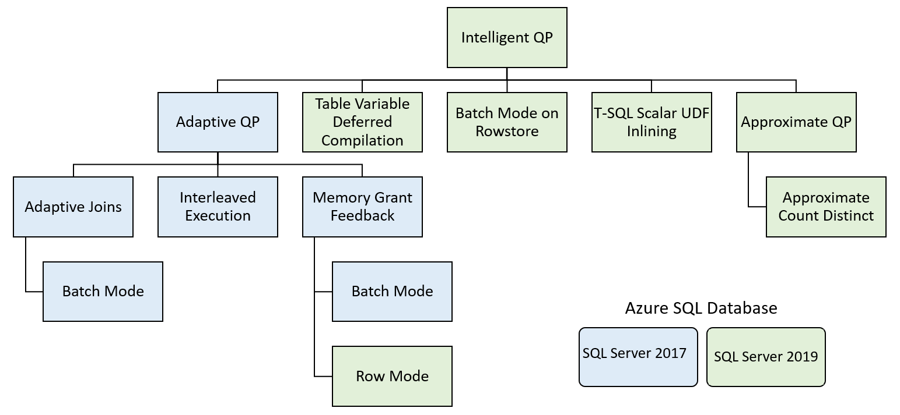

1. Blob Storage: Object based: Hot, cold and archive for db backups.
2. file storage: fileshare mounted inside a vm. storage target for failover cluster instance.
3. disk storage: managed disks offer block storage that is presented to a vm. 

#### Azure managed disks
1. Ultra disk: support high-io workloads for mission critical db with low latency.
2. Premium SSD: high-throughput and low latency and can meet the needs of most db workloads
3. Standard SSD: lightly used dev/test workloads or web servers that do a small amount of IO, and require predicatable latency
3. Standard HDD: bakcup and file storage. 

* Premium SSDs also support read-caching, which can benefit read-heavy database workloads by reducing the number of trips to the disk. The read cache is stored on the local SSD (the D:\ drive on Windows or /dev/sdb1/ on Linux) which can help reduce the number of round trips to the actual disk.

* to stripe your data across multiple disks
*  you add the number of disks you would like to the VM, and then create a pool using Storage Spaces in Windows. Don't configure any redundancy for your pool (which would limit your performance) as the redundancy is provided by the Azure framework, which keeps three copies of all disks in synchronous replication to protect against a disk failure.

---
## Best Practice
* Create a separate volume for data and transaction log files
* Enable read caching on the data file volume
* Don't enable any caching on the log file volume
* Plan for an extra 20% of IOPs and throughput when building your storage for your VM to handle workload peaks
* Use the D: drive (the locally attached SSD) for TempDB files because TempDB is recreated upon server restart, so there's no risk of data loss
* Enable instant file initialization to reduce the impact of file-growth activities.
* Move trace file and error log directories to data disks
* For workloads requiring storage latency under 1 millisecond, consider using Ultra disk over Premium SSD.

Azure Virtual Machine resource provider
: use the template provided in azure marketplace, configure your storage as part of your deploymnet.
: It also provides tempdb to the local ssd drive and create a scheduled task to create the folder on startup.

## Describe virtual machine resizing:
* Amount of memeory and iops the VM can perform.
### Using constrained cores
* based on cores, CPU Cores to memory reatio. 
* same amount of memroy, iops and storage but low cores.

### Using general purpose:
* most in general or memory-optimised families
* mostly general

## Resizing VMs
* requires restart

# optimise database storage: proportaional fill and tempdb
## UNderstand IO perf:
* service tier and vcores for iops needs. 
* impact: long I/O waits. 
* in vcore move to business critical or hyperscale.
* for prod if DTU then premium tier.
* Io latency: Conside business critical or hyperscale. more managed isntance move to business critical or **increase the file size** or number of files in the database. 
* multistatement transaction for txn log. and user defined filegroups and no of files and file size for io performance.

## Descripe proportional fill: 
* in the write-intensive tempdb, an uneven write pattern can create a bottleneck in the largest file, as it handles more writes.

### Configure Tempdb in SQL server
* the number of available CPUs during setup and configures the appropriate number of files, up to eight, with even sizing
* trace flag 1117 and 1118 are integrated to the db engine only for tempdb.

#### Use tempdb
* user-defined temp table,
* intermediate query results, sorting operation, and version store for row versioning
* local ssd drive
* 2 vcores = 4 files max 16
* 12 files for sql MI
* MIZWS_PAGE_ALLOCATION is set to OFF.
* AUTOGROW_ALL_FILES TO ON. 
* Tempdb metadata optimisation is not available for sql daabase and MI: can alleviate heavy latch contention

#### Database configuration.
```Alter database scoped configuration```
* for tempdb, minimal logging is allowed.

#### MAXDOP Configuration
* MAXDOP high, more parallel threads
* need extra memeory lead to memory pressure and affect storage performance. (rowgroup trimming)


### MAXDOP
* ALTER DATABASE SCOPED CONFIGURATION to configure MAXDOP is supported for Azure SQL.
* The stored procedure sp_configure for "max degree of parallelism" is supported for SQL Managed Instance.
* MAXDOP query hints are fully supported.
* Configuring MAXDOP with Resource Governor is supported for SQL Managed Instance.


### CONTROL SQL SERVER RESOURCES:
* Resource Governer: 2008
* uses a classifier funcation to define how connections are treated, subdiving sessions into workload groups.

#### Resource POOLs: default and internal. 
* internal: critical sql server funcation and cannot be restricted. 
* default: can be configured with limits on the resource they can use.

1. Max/min cpu %: when there is cpu contention
2. Cap of cpu %
3. Max/min memory %
4. NUMA Node affinity %
5. Max/min iops per volumne. 

###### workload gorup: container for request classified by the classifier function. Default and internal. 
* each workload to single resource pool. One pool can have many workloads.
*
##### Classifier function
* on user connection and session creationg. 

* used in multitanent scenario,
* limit the resource used by maintenance operations like consistency checks and index rebuilds.

### Configure database for optimal Performance
* ensure stats are correct and indexes are well organised.

## Understand database scoped configuration options
### Explore database maintenance checks
* statistical informtion from the indexes.
* Healthy index and stats

#### Rebuild and reorganize
* logical ordering in index pages != physical ordring. (insert, update, delete)
* locate extra page
* reorganize: defrag the leaf level (online) from left to right to match logical order. compacted based on fill factors
* rebuild: online or offline: offline: drop and recreate the index. online is new index in parallel to existing and existing dropped. 
* 5 to 30% is reorganize, >30% is rebuild (update stats).

* ```sys.dm_db_index_physical_stats``` for b-tree indexes and 
* ```sys.dm_db_column_store_row_group_physical_stats``` for columnstroe indexes

**Resumable rebild and MDOP**

#### Statistics:
* user database as blobs
* ```sys.stats``` cross apply ```sys.dm_db_stats_properties(object_id, stats_id) as sp where user_create=1```
* cardinality estimation ( what type of operation (index seek or scan to use))


* create statistics by default with AUTO_CREATE_STATISTICS on the indexed columns by default. alos create stats for single columns in the predicate. Using create stats
---
* The Database Engine Tuning Advisor suggests creating statistics
* The query predicate contains multiple columns that aren't already in the same index
* The query selects from a subset of data
* The query has missing statistics

### maintainence tasks
1. SQL server on VM: Scheduling service such as SQL agent or the windows task scheduler and custom jobs
2. Azure SQL database: no agent so
    * azure automation runbooks
    * sql agent job for sql server in an azure vm(remote call)
    * **azure sql elastic jobs**
3. Azure MI: You can schedule jobs ion SQL managed instance with agent. 

### Databbase scoped configuration options
* database level config settings
    * alter database scoped configuration syntax
---
* Database recovery models
* automatic euning option
* autocreate and update stats.
* query store options.
* snapshot isolation: level of isolation of the transaction.
---
* maximum degree of parallelism: db to have it own maxDop
* lagecy cardinality estimation: older estimator. Intelligent query processing in compatibility level 140 and 150
* Optimize for Ad Hoc Workloads: optimiser to store a stub query plan in the plan cache. Reduce the size of the plan cache for workload that have single use queries. 

Database compatibility level:

#### automatic tuning
* based on query store.
* plan checnes due to schema changes, index modification, data chen.
* AI for analysis of metrics.
* query exection plan regression. index tuning. 

#### Automatic plan correction
 the database engine will automatically force any recommended query execution plan, when:

* The previous plan had a higher error rate than the recommended plan
* The estimated CPU gain was greater than 10 seconds
* The force plan has performed better than the previous one
The plan will revert back to the last known good plan after 15 executions of the query.

**recompile** Hint
* ```alter database <> set automatic_tuning(force_last_good_plan=ON);```
* ```sys.database_automatic_tuning_options```
* ```sys.dm_db_tuning_recommendations```

### automatic index management
* it monitors the resource required to implement new indes to avaoid performance crunching. 

## Intelligent query processing


---
### Adaptive query processing
1. Adaptive Joins: defers choice of join between hash and nested loops based on no of rows going into join. Adaptive query only works in the batch exection mode.
2. Interleaved Exection: Multi-statement TVFs. before used fixed row estimates of either one or 100 rows. now actual count of rows are generated.
3. Memory grant feedback: over or under estimates of row counts, which can cause **over-grants of memory that decrease concurrency**, or under-grants cause query to spill data to tempdb. so it autoadjust the amount of memroy. 
### Table variable deferred compilation:
* table variables carry a fixed row count estimate of one row. like MSTVF. compilation same to interleaved exection. deferred compilation is similar. it's performed at the first compilation of the query rathre than dynamically adjust.

### Batch mode on row store
* allow data to be processed in batches. CPU costs and aggregations. seperate batch processing and columnstore indexes.
### Scalar user-defined function inlining
* UDF one row at a time, no proper cost estimation, no parallel.
* now, transformed into **scaler subqueries** in palce of UDF operator in plan. 

### Approximate count distinct
* approximate by grouping rows. 2% error rate with 97% confidence interval.


