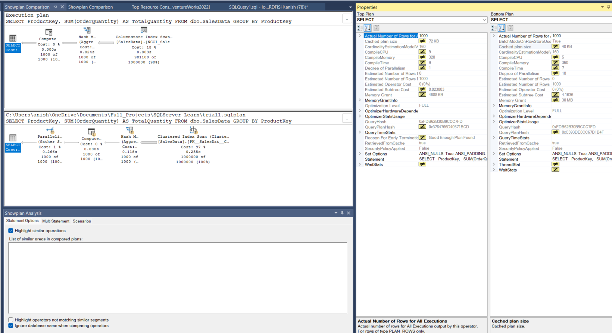

# All you need about explaining a query plan
</img>
#### Properties
1. Top plan: inefficient row mode (98%): Clustered index scan
    * for the aggrigation query over a million rows, this is very inefficient as it has to handle each row individually.
2. Bottom plan: efficient batch mode (2% cost): Columnstore Index scan
    * This operator enables Batch mode exection. Processes data in batches approx 900 rows at a time, reduce CPU overhead.
---
# V. Summary: Quick Reference Queries for Query Runtime

| Purpose | DMV / Feature | Notes |
|---------|---------------|-------|
| See currently running queries with time | `sys.dm_exec_requests` + `sys.dm_exec_sql_text` | Shows active sessions and SQL text |
| Find top 20 slowest historical queries | `sys.dm_exec_query_stats` + `sys.dm_exec_sql_text` + `sys.dm_exec_query_plan` | Rank by avg/total duration |
| Track query trends over days/weeks | Query Store → `sys.query_store_runtime_stats` | Historical workload analysis |
| Get actual runtime plan with row counts | `SET STATISTICS XML ON` → inspect XML output | Returns execution plan with actual rows |
| Detect memory spills and sort/hash warnings | `SET STATISTICS IO ON`; check `sys.dm_exec_query_stats` for grant usage | Watch for excessive spills |
| Capture every query execution for analysis | Extended Events: `sql_statement_completed` | Store in file or ring buffer |
| View live execution progress | SSMS → “Include Live Query Statistics” | Real-time operator-level progress |

---

# VI. Best Practices for Optimizing Query Runtime

| Area | Best Practice | Example / Detail |
|------|---------------|------------------|
| Cardinality Estimation | Keep statistics updated | `UPDATE STATISTICS`; use `AUTO_UPDATE_STATISTICS ON` |
| Plan Reuse | Parameterize queries, avoid local variables in predicates | Prevents plan cache bloat |
| Indexing | Cover queries with indexes to avoid lookups/scans | Composite indexes help |
| Parallelism | Configure `MAXDOP` appropriately | Use `OPTION (MAXDOP 1)` for OLTP workloads |
| Memory | Monitor performance counters | `Page Life Expectancy`, `Buffer Cache Hit Ratio` via `sys.dm_os_performance_counters` |
| TempDB | Place on fast SSDs; monitor space | Use `sys.dm_db_file_space_usage` for worktable growth |
| Query Store | Always enable in production | Detects regressions quickly |
| Avoid Implicit Conversions | Ensure matching datatypes | `WHERE ColInt = 123` instead of `WHERE ColInt = '123'` |
| Avoid Functions on Indexed Columns | Rewrite predicates | `WHERE OrderDate >= '2023-01-01' AND OrderDate < '2024-01-01'` instead of `WHERE YEAR(OrderDate) = 2023` |


```sql
--Show the runtime
SELECT 
    r.session_id,
    r.request_id,
    r.start_time,
    r.status,
    r.command,
    r.sql_handle,
    r.statement_start_offset,
    r.statement_end_offset,
    r.plan_handle,
    r.total_elapsed_time / 1000.0 AS total_elapsed_time_seconds,
    r.cpu_time / 1000.0 AS cpu_time_seconds,
    r.logical_reads,
    r.reads,
    r.writes,
    r.wait_type,
    r.wait_time,
    r.wait_resource,
    r.blocking_session_id,
    t.text AS batch_text,
    SUBSTRING(
        t.text, 
        (r.statement_start_offset/2) + 1,
        ((CASE r.statement_end_offset WHEN -1 THEN DATALENGTH(t.text)
         ELSE r.statement_end_offset END - r.statement_start_offset)/2) + 1
    ) AS current_statement_text
FROM sys.dm_exec_requests r
CROSS APPLY sys.dm_exec_sql_text(r.sql_handle) t
WHERE r.session_id > 50 -- Exclude system sessions
ORDER BY r.total_elapsed_time DESC;

-- query store: query text, execution plans, runtime statistics (CPU durations, i/o), and frequency over time
ALTER DATABASE AdventureWorks2022 
SET QUERY_STORE = ON (
    OPERATION_MODE = READ_WRITE,
    CLEANUP_POLICY = (STALE_QUERY_THRESHOLD_DAYS = 30),
    DATA_FLUSH_INTERVAL_SECONDS = 900,
    INTERVAL_LENGTH_MINUTES = 60,
    MAX_STORAGE_SIZE_MB = 1000,
    QUERY_CAPTURE_MODE = AUTO
);
GO
-- 10 longest running
SELECT TOP 10
    qt.query_sql_text,
    qsp.plan_id,
    qs.count_executions,
    qs.avg_duration / 1000.0 AS avg_duration_seconds,
    qs.last_duration / 1000.0 AS last_duration_seconds,
    qs.min_duration / 1000.0 AS min_duration_seconds,
    qs.max_duration / 1000.0 AS max_duration_seconds,
    qs.avg_cpu_time / 1000.0 AS avg_cpu_seconds,
    qs.avg_logical_io_reads,
    qs.avg_logical_io_writes,
    qs.avg_rowcount,
    qsp.query_plan
FROM sys.query_store_query_text qt
JOIN sys.query_store_query qq ON qt.query_text_id = qq.query_text_id
JOIN sys.query_store_plan qsp ON qq.query_id = qsp.query_id
JOIN sys.query_store_runtime_stats qs ON qsp.plan_id = qs.plan_id
WHERE qs.last_execution_time > DATEADD(HOUR, -24, GETUTCDATE()) -- Last 24 hours
ORDER BY qs.avg_duration DESC;
-- Plan cache performance: high-cost queries across the instance
SELECT TOP 20
    qs.execution_count,
    qs.total_elapsed_time / 1000.0 AS total_elapsed_time_seconds,
    qs.total_elapsed_time / qs.execution_count / 1000.0 AS avg_elapsed_time_seconds,
    qs.total_worker_time / 1000.0 AS total_cpu_time_seconds,
    qs.total_worker_time / qs.execution_count / 1000.0 AS avg_cpu_time_seconds,
    qs.total_logical_reads,
    qs.total_logical_reads / qs.execution_count AS avg_logical_reads,
    qs.total_physical_reads,
    qs.total_physical_reads / qs.execution_count AS avg_physical_reads,
    qs.total_logical_writes,
    qs.total_logical_writes / qs.execution_count AS avg_logical_writes,
    qs.last_execution_time,
    SUBSTRING(
        st.text, 
        (qs.statement_start_offset/2) + 1,
        ((CASE qs.statement_end_offset WHEN -1 THEN DATALENGTH(st.text)
         ELSE qs.statement_end_offset END - qs.statement_start_offset)/2) + 1
    ) AS statement_text,
    qp.query_plan
FROM sys.dm_exec_query_stats qs
CROSS APPLY sys.dm_exec_sql_text(qs.sql_handle) st
CROSS APPLY sys.dm_exec_query_plan(qs.plan_handle) qp
WHERE st.text NOT LIKE '%sys.dm_exec%'
ORDER BY qs.total_elapsed_time DESC;
/*
avg_elapsed_time, total_logical_reads: total pages read from cache, key indicator of efficiency.
*/
SET STATISTICS XML ON;
GO

-- Your query here
SELECT 
    p.ProductID, 
    p.Name, 
    SUM(sod.LineTotal) AS TotalSales
FROM Production.Product p
INNER JOIN Sales.SalesOrderDetail sod ON p.ProductID = sod.ProductID
WHERE p.Color = 'Red'
GROUP BY p.ProductID, p.Name
HAVING SUM(sod.LineTotal) > 1000
ORDER BY TotalSales DESC;
GO

SET STATISTICS XML OFF;
GO
/*
Actual rows counts vs estimated row counts
actual exection time per operator (hover over operator)
Warnings (eg: missing index, implicit conversions).
memory grants, spills to tempdb (```memory grant, sort warning, hash warning```
example: if estimated row count =100 but actual rows= 100,000 then optimizer choose wrong join type: poor runtime.
*/
--- One of the biggest problem is spills to tempdb causes massive slowdowns.
--- Common cause: predicates, bad statistics, table valued functions or missing indexes. Either through plans or extended events. 
--- Hash join (join two unsorted sources efficiently) requires a single pass over each source so it splits into subpartitions if not fit in available memeory. Used also for Distinct clasue and grouping aggregates.
--- How could we force optimiser for differnt joins.
--- Optimiser would pick LOOP if could seek the inner side for a reasonable no of times, need index on the inner side to allow a seek.
--- Merge join needs both inputs to be sorted. 
/*
Sort warning event is when the sort doesn't fit in the memory. not sort operations for creating of index but in query (such as orderby clause)
Optimiser pospone the sort order util all filtering is applied. If sort spills is to add a covering index that provides the desired order. 
*/
-- Exchange spill events: Communication buffer in parallel query has been temerorarly written to the tempdb. Multiple range scans. 
-- Spool spill is meant to be spill. 

SELECT 
    qs.sql_handle,
    qs.plan_handle,
    qs.query_hash,
    qs.query_plan_hash,
    qs.last_execution_time,
    qs.total_worker_time,
    qs.total_elapsed_time,
    qs.total_logical_reads,
    qs.total_physical_reads,
    qs.total_logical_writes,
    qs.execution_count,
    qs.total_grant_kb,
    qs.max_grant_kb,
    qs.total_used_grant_kb,
    qs.max_used_grant_kb,
    qs.total_reserved_threads,
    qs.max_reserved_threads,
    qs.total_page_server_reads,
    qs.last_dop,
    qs.min_dop,
    qs.max_dop,
    CASE WHEN qs.total_grant_kb > 0 AND qs.max_used_grant_kb > qs.total_grant_kb * 0.8 
         THEN 'High Memory Pressure' 
         ELSE 'Normal' END AS memory_status
FROM sys.dm_exec_query_stats qs
WHERE qs.total_grant_kb > 0
ORDER BY qs.max_used_grant_kb DESC;
-- High total_page_server_reads indicates buffer pool pressure. 
SET STATISTICS IO ON;
GO
SELECT * FROM Sales.SalesOrderHeader WHERE OrderDate > '2020-01-01';
GO
-- Output will show:
-- Table 'SalesOrderHeader'. Scan count 1, logical reads 1200, physical reads 5, read-ahead reads 1100.
-- For extended and depth monitoring
CREATE EVENT SESSION [QueryRuntimeMonitoring] ON SERVER 
ADD EVENT sqlserver.sql_statement_completed(
    ACTION(
        sqlserver.sql_text,
        sqlserver.client_app_name,
        sqlserver.database_name,
        sqlserver.username,
        sqlserver.plan_handle,
        sqlserver.query_hash,
        sqlserver.query_plan_hash
    )
)
ADD TARGET package0.ring_buffer
WITH (
    MAX_MEMORY=4096 KB, 
    EVENT_RETENTION_MODE=ALLOW_SINGLE_EVENT_LOSS, 
    MAX_DISPATCH_LATENCY=30 SECONDS
);
GO
-- Start the session
ALTER EVENT SESSION [QueryRuntimeMonitoring] ON SERVER STATE = START;
GO

SELECT 
    xed.event_data.value('(event/@timestamp)[1]', 'datetime2') AS timestamp,
    xed.event_data.value('(event/data[@name="duration"]/value)[1]', 'bigint') / 1000.0 AS duration_ms,
    xed.event_data.value('(event/data[@name="cpu_time"]/value)[1]', 'bigint') / 1000.0 AS cpu_time_ms,
    xed.event_data.value('(event/data[@name="logical_reads"]/value)[1]', 'bigint') AS logical_reads,
    xed.event_data.value('(event/data[@name="physical_reads"]/value)[1]', 'bigint') AS physical_reads,
    xed.event_data.value('(event/action[@name="sql_text"]/value)[1]', 'nvarchar(max)') AS sql_text,
    xed.event_data.value('(event/action[@name="client_app_name"]/value)[1]', 'nvarchar(128)') AS client_app,
    xed.event_data.value('(event/action[@name="database_name"]/value)[1]', 'nvarchar(128)') AS database_name
FROM (
    SELECT 
        CAST(st.target_data AS XML) AS target_data
    FROM sys.dm_xe_session_targets st
    JOIN sys.dm_xe_sessions s
        ON s.address = st.event_session_address
    WHERE s.name = N'QueryRuntimeMonitoring'
      AND st.target_name = N'ring_buffer'
) AS t
CROSS APPLY t.target_data.nodes('//RingBufferTarget/event') AS q(xed)
CROSS APPLY (SELECT q.xed.query('.') AS event_xml) AS evt(event_xml)
CROSS APPLY (SELECT CAST(evt.event_xml AS XML)) AS xed(event_data)
WHERE xed.event_data.value('(event/@name)[1]', 'varchar(100)') = 'sql_statement_completed'
ORDER BY duration_ms DESC;
-- Spill runtime monitoring
CREATE EVENT SESSION [SpillMonitoring] ON SERVER 
ADD EVENT sqlserver.sort_warning(
    ACTION(sqlserver.sql_text, sqlserver.database_name, sqlserver.username)
),
ADD EVENT sqlserver.hash_warning(
    ACTION(sqlserver.sql_text, sqlserver.database_name, sqlserver.username)
)
ADD TARGET package0.ring_buffer
WITH (
    MAX_MEMORY=4096 KB, 
    EVENT_RETENTION_MODE=ALLOW_SINGLE_EVENT_LOSS, 
    MAX_DISPATCH_LATENCY=30 SECONDS
);
GO

SELECT
    xed.event_data.value('(event/@timestamp)[1]', 'datetime2') AS [timestamp],
    xed.event_data.value('(event/@name)[1]', 'varchar(100)') AS [spill_type],
    xed.event_data.value('(event/data[@name="spill_level"]/value)[1]', 'int') AS [spill_level],
    xed.event_data.value('(event/action[@name="sql_text"]/value)[1]', 'nvarchar(max)') AS sql_text,
    xed.event_data.value('(event/action[@name="database_name"]/value)[1]', 'nvarchar(128)') AS database_name,
    xed.event_data.value('(event/action[@name="username"]/value)[1]', 'nvarchar(128)') AS username
FROM (
    SELECT CAST(st.target_data AS XML) AS target_data
    FROM sys.dm_xe_session_targets st
    JOIN sys.dm_xe_sessions s
        ON s.address = st.event_session_address
    WHERE s.name = N'SpillMonitoring'
      AND st.target_name = N'ring_buffer'
) AS t
CROSS APPLY target_data.nodes('//RingBufferTarget/event') AS q(xed)
CROSS APPLY (SELECT q.xed.query('.') AS event_xml) AS evt(event_xml)
CROSS APPLY (SELECT CAST(evt.event_xml AS XML)) AS xed(event_data)
ORDER BY [timestamp] DESC;
-- No spill yet.
```
```Golden Rule: Don’t trust estimated plans — always validate with actual runtime data.```
---
### Types of join
1. Nested Loops join: small inner table and indexed outer table. ```inner join```.
```SQL
SELECT o.OrderID, od.ProductID
FROM Orders o
INNER JOIN OrderDetails od ON o.OrderID = od.OrderID
WHERE o.CustomerID = 123; 
```
2. Merge join: both tables are sorted, best case ```inner join, left outer join```.
```sql
-- Both tables have clustered index on join key
SELECT c.CustomerID, o.OrderID
FROM Customers c
INNER JOIN Orders o ON c.CustomerID = o.CustomerID
ORDER BY c.CustomerID;
```
3. Hash match join (hash join): worst: build hash table form smaller input and probe with larger input. no index. ```inner join, full outer join, except, intersect```. Spilling
```sql
-- No indexes on join columns, large tables
SELECT p.ProductName, s.SalesPersonID
FROM Products p
INNER JOIN Sales s ON p.CategoryID = s.CategoryID;
-- CategoryID has no index, both tables are 500K+ rows
```
---
    Pro Tips:
    1. If you see a Nested Loops with a Table Scan on the inner side → that’s bad! You need an index on the join column.
    2. Merge Join Requires Sort Order: If you don’t have the sort order, SQL Server adds a Sort operator → expensive! First create index on join key with correct sort.
    3. If the build input is too big for memory → Hash Spill to TempDB → disk I/O → 100x slowdown.
---
### Oder by, group by, distinct
```Rules```
1. If your ORDER BY columns are the leading columns of an index, and all selected columns are included → no sort required.
```CREATE INDEX IX_Product_ListPrice ON Production.Product(ListPrice DESC, ProductID, Name);```
2. Now SQL Server can do Stream Aggregate (fast, single pass) instead of Hash Aggregate (memory-heavy).
```
Bad grouping on unindexed columns

Check execution plan: 
Stream Aggregate → green icon, “Stream Aggregate"
Hash Aggregate → orange icon, “Hash Match (Aggregate)”
```
3. DISTINCT is logically equivalent to GROUP BY. Use the same indexing strategy.

### Where Clause: Filtering, Predicates and cardinality Estimation
1. Your WHERE clause determines how many rows SQL Server thinks it needs to process. Bad estimates = bad plans.
```sql
-- BAD: Forces full scan
SELECT * FROM Sales.SalesOrderHeader
WHERE YEAR(OrderDate) = 2023;

-- GOOD: Sargable predicate → uses index
SELECT * FROM Sales.SalesOrderHeader
WHERE OrderDate >= '2023-01-01' AND OrderDate < '2024-01-01';
```
|non-SARGable Predcates| SARGable (Search argumnet able)|
|---|---|
|```WHERE UPPER(Name) = 'JOHN'```| ```WHERE Column = Value```|
|WHERE Column + 1 = 100|WHERE Column > Value |
|WHERE SUBSTRING(Code, 1, 3) = 'ABC'|WHERE Column LIKE 'ABC%'|
| WHERE ISNULL(Status, 'Active') = 'Active'|WHERE Column IN (1,2,3)|
||WHERE Column BETWEEN X AND Y|
---
* LIKE '%ABC' → Full scan (can’t use index) 
* LIKE 'ABC%' → Index seek (if index exists) 
---
### Handling Null
```
-- BAD: Non-SARGable
WHERE ISNULL(Email, '') = ''

-- GOOD: Explicit NULL handling
WHERE Email IS NULL OR Email = ''
```
### Use In vs OR vs Exists
```
-- BAD: Multiple ORs → hard to optimize
SELECT * FROM Sales.SalesOrderHeader
WHERE CustomerID = 1 OR CustomerID = 2 OR CustomerID = 3;

-- BETTER: IN
SELECT * FROM Sales.SalesOrderHeader
WHERE CustomerID IN (1,2,3);

-- BEST: EXISTS with correlated subquery (if checking existence)
SELECT * FROM Sales.SalesOrderHeader h
WHERE EXISTS (
    SELECT 1 FROM @CustomerList c
    WHERE c.CustomerID = h.CustomerID
);
```
* IN with small list → converted to OR → OK
* IN with large list → better as JOIN to temp table
* EXISTS preferred over IN when subquery returns many rows — stops at first match 

### Parameter Sniffing:
```
-- Stored procedure with parameter sniffing
CREATE PROC GetOrdersByCustomer(@CustID INT)
AS
SELECT * FROM Sales.SalesOrderHeader WHERE CustomerID = @CustID;
```
1. Option(RECOMPILE): sniff value at runtime.
2. Local variable: force generic estimate (30%)
3. Optimize for unknown: average desity
```
Use OPTION (RECOMPILE) for highly skewed data (e.g., admin reports).
Use OPTIMIZE FOR UNKNOWN for OLTP with uniform distribution.

SELECT * FROM Sales.SalesOrderHeader
WHERE CustomerID = @CustID OPTION (RECOMPILE);
SELECT * FROM Sales.SalesOrderHeader
WHERE CustomerID = @CustID OPTION (OPTIMIZE FOR UNKNOWN);
DECLARE @c INT = @CustID;
SELECT * FROM Sales.SalesOrderHeader WHERE CustomerID = @c;
```
### Subqueries, CTEs, and Derived Tables: What's the Cost?
1. Correlated subqueries (slow): you are using value from the outer query for its exection usually used inside the where predicate. row-by-row exection
```
SELECT last_name, salary, department_id
FROM employees e
WHERE salary > (
    SELECT AVG(salary)
    FROM employees
    WHERE department_id = e.department_id
);
```
2. Rewrite as Join: Single scan massive imporvement
3. CTEs vs Temp tables
```
-- CTE (in-memory, non-materialized)
WITH SalesSummary AS (
    SELECT CustomerID, SUM(TotalDue) AS TotalSales
    FROM Sales.SalesOrderHeader
    GROUP BY CustomerID
)
SELECT * FROM SalesSummary WHERE TotalSales > 10000;

-- Temp Table (materialized, can be indexed)
SELECT CustomerID, SUM(TotalDue) AS TotalSales
INTO #TempSales
FROM Sales.SalesOrderHeader
GROUP BY CustomerID;

CREATE INDEX IX_TempSales_TotalSales ON #TempSales(TotalSales);
SELECT * FROM #TempSales WHERE TotalSales > 10000;

Use CTE for simple, single-use logic
Use #Temp Table if reused, filtered, or indexed
Use #Temp Table for > 10K rows with complex joins 
```
```Never use CTEs for recursive logic unless necessary — they’re not always optimized well.```

### Indexing Strategy: The foundation of Query Optimisation
1. Clustered Indexes: 