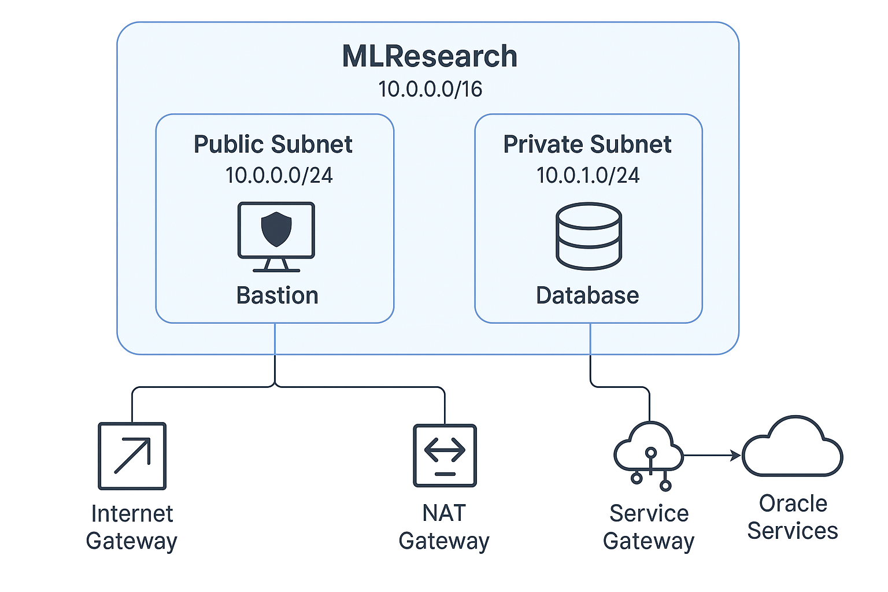

# 🧠 Oracle VCN Setup: MLResearch (Full Annotated Version)

This markdown outlines the **Virtual Cloud Network (VCN)** named `MLResearch` in Oracle Cloud, including **definitions**, **functions**, and **rationale** for key configurations such as route tables, security lists, gateways, and CIDR blocks.

---

## 🌐 What is a VCN?

A **Virtual Cloud Network (VCN)** is a logically isolated network in Oracle Cloud Infrastructure (OCI), similar to a traditional data center network, including subnets, gateways, route tables, and firewalls (security lists).

---

## 🔧 VCN Configuration

| Key         | Value                            |
|-------------|----------------------------------|
| Name        | MLResearch                       |
| Compartment | MachineLearningAI                |
| CIDR Block  | 10.0.0.0/16                      |
| DNS Domain  | MLResearch.oraclevcn.com         |

> 🔹 `10.0.0.0/16` gives us 65,536 IPs, to be divided into subnets.

---

## 📍 Subnet Design

Subnets divide the VCN into **public** and **private** zones for secure resource separation.

### 🌐 Public Subnet

| Detail        | Value                    |
|---------------|--------------------------|
| Name          | public subnet-MLResearch |
| CIDR          | 10.0.0.0/24              |
| Security List | default                  |
| Route Table   | default                  |

- **Purpose:** Hosts internet-facing resources (e.g., Bastion or Web App)
- **Access:** Has **direct** internet access via **Internet Gateway**

### 🔒 Private Subnet

| Detail        | Value                           |
|---------------|---------------------------------|
| Name          | private subnet-MLResearch       |
| CIDR          | 10.0.1.0/24                     |
| Security List | private subnet security list    |
| Route Table   | private subnet route table      |

- **Purpose:** Hosts secure, internal resources (e.g., databases, APIs)
- **Access:** Only outbound internet via **NAT Gateway**, and OCI services via **Service Gateway**

---

## 🚪 Gateways

| Name                     | Type             | Function                                                                 |
|--------------------------|------------------|--------------------------------------------------------------------------|
| Internet gateway-MLResearch | Internet Gateway | Allows public subnet VMs to send/receive internet traffic                |
| NAT gateway-MLResearch      | NAT Gateway      | Allows private subnet VMs to make **outbound** internet requests only    |
| Service gateway-MLResearch  | Service Gateway  | Allows private subnet to access OCI services (like Object Storage) **privately** |

---

## 🛣️ Route Tables Explained

### 🔹 Why use `0.0.0.0/0`?

- **Definition:** `0.0.0.0/0` matches **any IP address** — it's the **default route** for external/unmatched traffic.
- **Purpose:** Used to direct **internet-bound** traffic or OCI API traffic via gateways.

### 📘 default route table for MLResearch (used by public subnet)

| Destination    | Target           |
|----------------|------------------|
| `0.0.0.0/0`    | Internet Gateway |

> ✅ Sends *all* outbound traffic to the internet.

### 📘 route table for private subnet-MLResearch

| Destination                | Target          |
|----------------------------|------------------|
| `0.0.0.0/0`                | NAT Gateway     |
| All SYD Oracle Services    | Service Gateway |

> ✅ Keeps traffic private & secure while still allowing outbound and service access.

---

## 🔐 Security Lists Explained

Security lists control **inbound (ingress)** and **outbound (egress)** traffic to VMs.

### 🔹 Why `0.0.0.0/0` in Ingress?

- **Means:** Allow access from *anywhere*.
- **Use Case:** Public-facing SSH or HTTP/HTTPS traffic.

> ⚠️ Use sparingly — it's **open to the world**. Limit using IP whitelisting if possible.

### 🔹 Why `0.0.0.0/0` in Egress?

- **Means:** Allow outbound traffic to *anywhere*.
- **Use Case:** Allows updates, package installs, API calls.

> ✅ Common and often necessary unless you’re enforcing strict egress controls.

### 🛡️ default security list for MLResearch (public subnet)

| Type     | Source/Destination | Protocol    | Ports/Details                          |
|----------|--------------------|-------------|----------------------------------------|
| Ingress  | `0.0.0.0/0`        | TCP         | Port 22 (SSH)                          |
| Ingress  | `0.0.0.0/0`        | ICMP        | Type 3 (Destination unreachable)       |
| Egress   | `0.0.0.0/0`        | ALL         | All traffic                            |

### 🛡️ security list for private subnet-MLResearch

| Type     | Source/Destination | Protocol    | Ports/Details                            |
|----------|--------------------|-------------|------------------------------------------|
| Ingress  | `10.0.0.0/16`      | TCP         | Port 22 (SSH from within VCN)            |
| Ingress  | `0.0.0.0/0`        | ICMP        | Type 3 (unreachable), Type 4 (fragment)  |
| Egress   | `0.0.0.0/0`        | ALL         | All traffic                              |

---

## 🧠 Summary of Core Concepts

| Concept              | Meaning                                                     | Why It's Used                                                                 |
|----------------------|-------------------------------------------------------------|--------------------------------------------------------------------------------|
| `0.0.0.0/0` in Route | Default route — covers all IPs                              | Needed for internet or service access                                          |
| `0.0.0.0/0` in Ingress| Allow access from anywhere                                 | Used for SSH/public ports on bastion                                           |
| `0.0.0.0/0` in Egress | Allow all outbound traffic                                 | Required for app updates, external APIs                                        |
| Internet Gateway     | Public IP internet access                                  | Connects public subnet VMs to the internet                                    |
| NAT Gateway          | Secure outbound access from private subnet                | Enables internet updates without public IP                                    |
| Service Gateway      | Private access to Oracle services                          | Keeps traffic private and avoids internet                                     |

---

## 📈 Network Architecture Diagram

Refer to the attached network diagram that visually explains how the VCN, subnets, gateways, and OCI services connect and interact.

